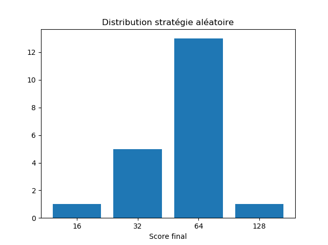
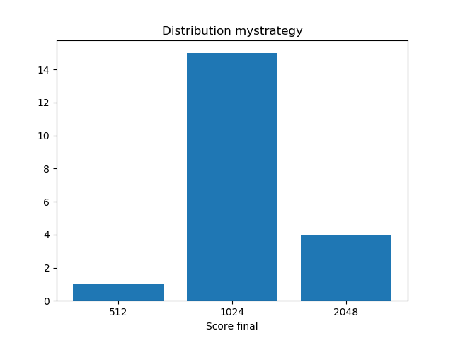

# strategy2048

Projet de résolution du jeu 2048.

L'implémentation du jeu est celle de Xavier Dupré, voir https://github.com/sdpython/pystrat2048

-----------------

## 1ère stratégie : tester un certain nombre de jeux aléatoires

Pour chaque mouvement, tester plusieurs jeux aléatoires jusqu'à échec, et choisir le mouvement qui maximise la moyenne du score final.

## 2ème stratégie : maximiser le nombre de fusions

On regarde pour chaque mouvement le nombre de fusions possibles pour le maximiser. 
Une version améliorée regarde à plus long terme, avec une profondeur définie, pour maximiser le nombre de fusions.

## Stratégie finale : utilisation d'un score

On cherche à maximiser un score. Le score est fonction :

* Du nombre de cases vides
* De la ressemblance à un filtre, ce filtre favorisant les grands nombres sur les bords

Une version amélioré regarde, pour chaque mouvement, sur plusieurs jeux (profondeur définie) dans le but de maximiser le score. 

Des fonctions de tests permettent de déterminer les différents paramètres numériques (coefficients dans la fonction de score, profondeur à atteindre dans l'arbre de recherche, nombre de chemins à parcourir dans l'abre). L'utilisation du multiprocessing et du profiling ont permis de rendre plus rapides ces calculs. 

## Résultats 

On teste tout d'abord une stratégie purement aléatoire avec 20 essais. Le score maximal atteint est de 128 avec une moyenne de 57. 
Temps de calcul : 0.03 s

On teste ensuite notre stratégie finale avec 20 essais. Le score maximal atteint est 2048 avec une moyenne de 1203. 20% des essais atteignent 2048. 
Temps de calcul : 6 min

-----------------

2019
